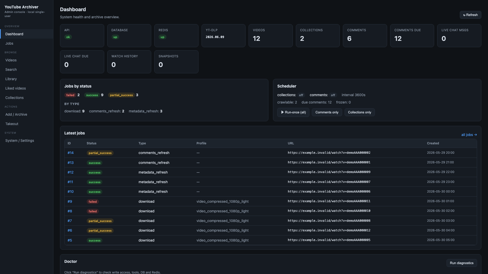
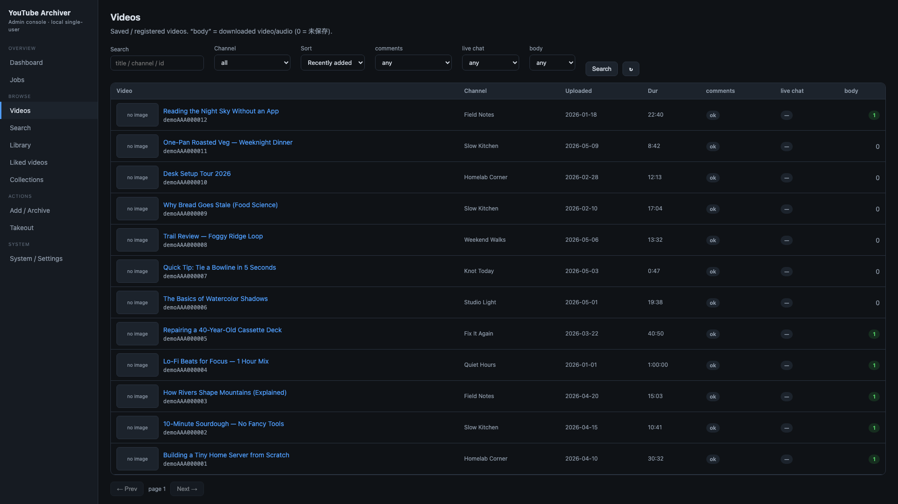
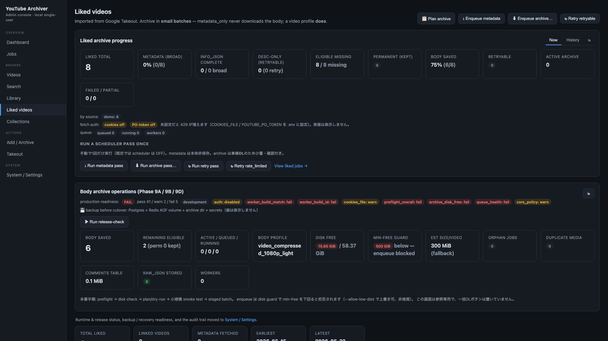
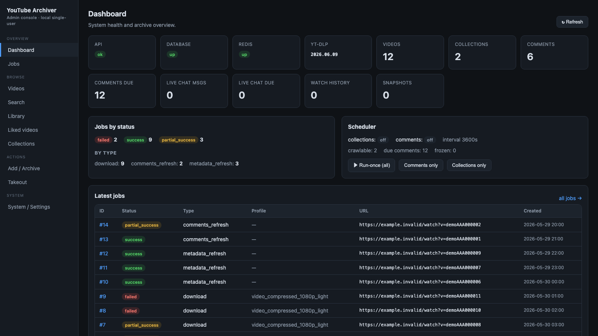

# Demo preview (synthetic data)

These screenshots come from an **isolated demo stack** seeded with entirely
**synthetic** data — invented titles, channels, ids (`demoAAA…`) and
`example.invalid` URLs. No real videos, accounts, cookies, tokens or personal
data are involved, and no real archive is touched.

| Screen | Preview |
| --- | --- |
| Dashboard (1920) |  |
| Videos (1920) |  |
| Liked videos (1920) |  |
| Dashboard (1600) |  |

## Reproduce it yourself

The demo runs as a **separate compose project** with its own throwaway volumes,
published only to loopback on port **18080**, so it never collides with — or
writes to — a real stack.

```bash
PROJ=ya-demo
FILES="-f docker-compose.yml -f docker-compose.demo.yml"

# 1. build + start the isolated stack (fresh, empty database)
docker compose -p $PROJ $FILES up -d --build postgres redis migrate web

# 2. seed the synthetic dataset (refuses to run against a populated database)
docker compose -p $PROJ $FILES exec -e YA_DEMO_SEED_CONFIRM=yes web \
    python scripts/demo_seed.py

# 3. open the UI
open http://127.0.0.1:18080     # or just browse there

# 4. tear it all down — `-v` only removes THIS project's volumes
docker compose -p $PROJ $FILES down -v
```

`scripts/demo_seed.py` is the single source of the synthetic dataset (12 videos
in mixed states, a realistic spread of succeeded / partial / failed jobs, two
playlists, comments, and liked entries). It has two independent safety guards:
it needs `YA_DEMO_SEED_CONFIRM=yes`, and it aborts if the target database already
holds more than a handful of videos — so it can never seed a real archive.

> The demo intentionally shows the honest **not-production-ready** posture
> (release-check FAIL, auth disabled, known CVEs accepted for local single-user
> use). See [`SECURITY.md`](../../SECURITY.md).
